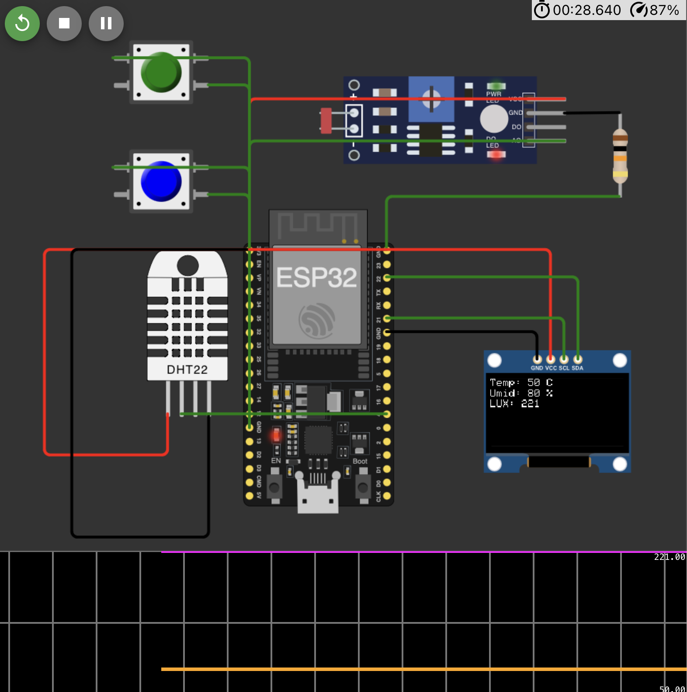

# FIAP - Faculdade de Informática e Administração Paulista

## Fase 4 Cap 1 – Automação e inteligência na FarmTech Solutions
[GitHub](https://github.com/pedrosof/Fase4_Cap1)

## Link do Projeto no WokWi
[Wokwi]](https://wokwi.com/projects/415711477314913281)

### Grupo 15

👨‍🎓 **Integrantes**:
- [Fabio Marcos Pedroso Filho](https://www.linkedin.com/in/pedrosof/)

👩‍🏫 **Professores**:

**Tutor(a)**:
- [Lucas Gomes Moreira](https://www.linkedin.com/in/lucas-gomes-moreira-15a8452a/)

**Coordenador(a)**:
- [Andre Godoi, PhD](https://www.linkedin.com/in/profandregodoi/)

---

# Documentação do Código - Monitoramento de Temperatura, Umidade, LUX e Botões com OLED

## Descrição
Este código realiza o monitoramento de três variáveis ambientais (temperatura, umidade e luminosidade) usando os sensores **DHT22** e **LDR**, além de capturar o estado de dois botões (**P** e **K**). Os dados são exibidos em um display **OLED** e enviados ao **Monitor Serial** para monitoramento em tempo real.

### Componentes Utilizados:
- **ESP32** (ou Arduino compatível)
- **Sensor de Temperatura e Umidade DHT22**
- **LDR (Photoresistor)**
- **Display OLED SSD1306**
- **Botões (P e K)**

## Funcionalidades
1. **Leitura de Temperatura e Umidade**:
   - O sensor **DHT22** é utilizado para ler a temperatura e a umidade do ambiente.
   - As leituras são enviadas ao **Monitor Serial** e exibidas no display OLED.

2. **Leitura de Luminosidade (LUX)**:
   - O **LDR** (photoresistor) lê a intensidade da luz ambiente.
   - O valor de **LUX** é calculado e exibido no display OLED e no **Monitor Serial**.

3. **Monitoramento de Botões**:
   - Dois botões (**P** e **K**) estão configurados nos pinos **GPIO 27** e **GPIO 26**, respectivamente.
   - Quando um botão é pressionado, uma mensagem é exibida no **Monitor Serial** e no display OLED.

## Estrutura do Código

### Definição de Pinos
- **DHT22 (Temperatura e Umidade)**: Pino **4**
- **LDR (Luminosidade)**: Pino **34**
- **Botão P**: Pino **27**
- **Botão K**: Pino **26**
- **SDA e SCL**: Pinos **22** e **21**, respectivamente (para comunicação I2C com o display OLED)

### Inicialização:
1. **Comunicação Serial**: Inicializa a comunicação serial a 115200 bps.
2. **Display OLED**: Inicializa o display **SSD1306** via I2C (endereço **0x3C**).
3. **Sensor DHT22**: Inicializa o sensor **DHT22** para leitura de temperatura e umidade.
4. **Leitura do LDR**: Configura a resolução de leitura do **LDR** para 12 bits.

### Funções Principais:
1. **Leitura de Sensores**:
   - **Temperatura e Umidade**: Lidos com o sensor **DHT22** usando a função **`dht.readTemperature()`** e **`dht.readHumidity()`**.
   - **Luminosidade**: Lido com **`analogRead(LDR_PIN)`** e mapeado para a faixa de **0 a 1000 LUX**.
   
2. **Botões**:
   - **Botão P**: Monitorado através de **`digitalRead(BUTTON_P)`** no **GPIO 27**.
   - **Botão K**: Monitorado através de **`digitalRead(BUTTON_K)`** no **GPIO 26**.

3. **Display OLED**:
   - Exibe os valores de **Temperatura**, **Umidade** e **LUX**.
   - Exibe mensagens indicando se os botões **P** ou **K** foram pressionados.

4. **Monitor Serial**:
   - Os valores de **Temperatura**, **Umidade** e **LUX** são enviados ao **Monitor Serial** a cada ciclo de leitura.

## Exemplo de Saída do Monitor Serial:

## Funcionamento:

1. **Leitura de Dados**: O código lê periodicamente os valores de temperatura, umidade e luminosidade. Esses dados são exibidos no display OLED e também enviados ao **Monitor Serial**.
2. **Interação com Botões**: Quando um botão é pressionado, uma mensagem correspondente é exibida tanto no OLED quanto no **Monitor Serial**.
3. **Atraso entre Leituras**: O código possui um atraso de 1 segundo entre as leituras dos sensores, com um total de **2 segundos** antes de exibir a próxima atualização.

## Considerações:
- **Display OLED**: Exibe os valores de **Temperatura**, **Umidade** e **LUX**, além do estado dos botões pressionados.
- **Botões**: Pressionar os botões exibe uma mensagem no display OLED e no Monitor Serial.
- **Monitor Serial**: Exibe as leituras em formato textual, útil para depuração e monitoramento em tempo real.

## Conclusão:
Esse código fornece uma forma simples e eficiente de monitorar a temperatura, a umidade, a luminosidade e a interação com botões físicos, tudo exibido no display OLED e monitorado via **Monitor Serial**.

